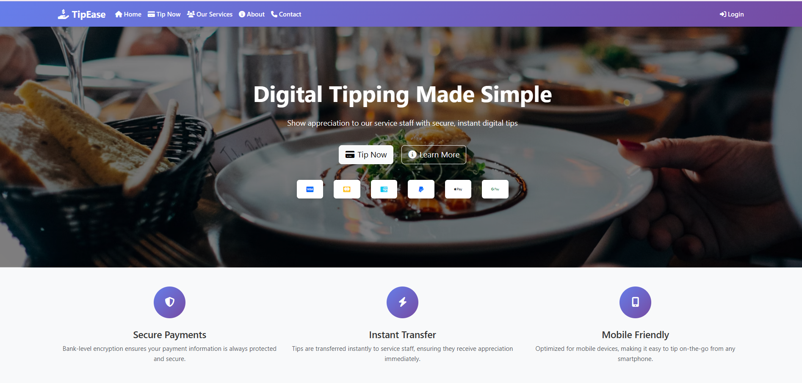

# 💸 TipEase – Smart Tipping System

TipEase is a modern and user-friendly tipping platform that enables customers to easily tip service staff digitally using Razorpay. Built with Django and Bootstrap, TipEase provides a seamless tipping experience with real-time updates, tip tracking, and secure payments.

## 🌟 Features

- 🧾 **Digital Tipping**: Send tips to waiters via Razorpay integration.
- 📊 **Tip Dashboard**: Track total tips received by each waiter.
- 📱 **Mobile-Friendly UI**: Fully responsive Bootstrap-based frontend.
- 🧑‍🍳 **Waiter Profiles**: View individual tip records.
- 🔒 **Secure Transactions**: Reliable payment handling using Razorpay.
- 🗂️ **Admin Panel**: Easily manage waiters and tip data through Django admin.

## 🛠️ Tech Stack

- **Backend**: Django, Python
- **Frontend**: HTML5, CSS3, Bootstrap 5, JavaScript
- **Database**: SQLite (default), can be upgraded to PostgreSQL or MySQL
- **Payments**: Razorpay Payment Gateway

## 📸 Screenshots

| Homepage                        | Tip Payment                          |
|-------------------------------|--------------------------------------|
|  |  |

## 🚀 Getting Started

### 1. Clone the Repository

```bash
git clone https://github.com/GURUPRASAD178/tipease.git
cd tipease
